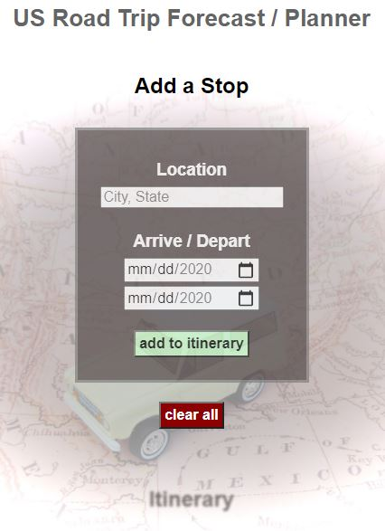
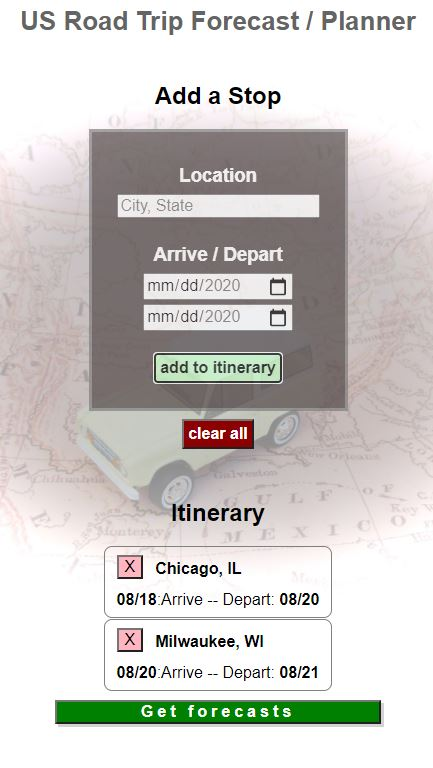
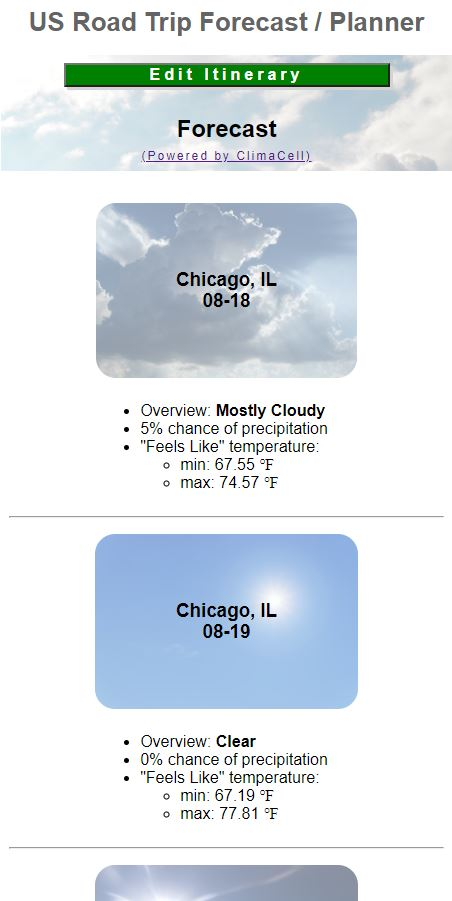

# US Road Trip Forecast / Planner

(API Hack Capstone project for Thinkful Web Development bootcamp)

[Live Site](https://brianhook1183.github.io/roadtrip-forecast/)

## Summary
The main utility of this app is to see a forecast across multiple cities and date ranges in a single view, instead of needing to check multiple extended forecasts for each city one by one.

A simple form is displayed to a add a location with an arrival and departure date to an itinerary.

Multiple road trip stops with varying stay durations can be added to the itinerary, with the ability to delete indivudual stops, or clear the entire itinerary.

After the forecasts are displayed, users can click back to the itinerary to make further edits.

## Screenshots

Landing Page:

Itinerary:

Forecasts:

## Technologies
This app was created with HTML, CSS, Javascript, and JQUERY

### APIs used

Open Cage for the location input to coordinates conversion
CimaCell which uses corrdinates for weather forecasts
